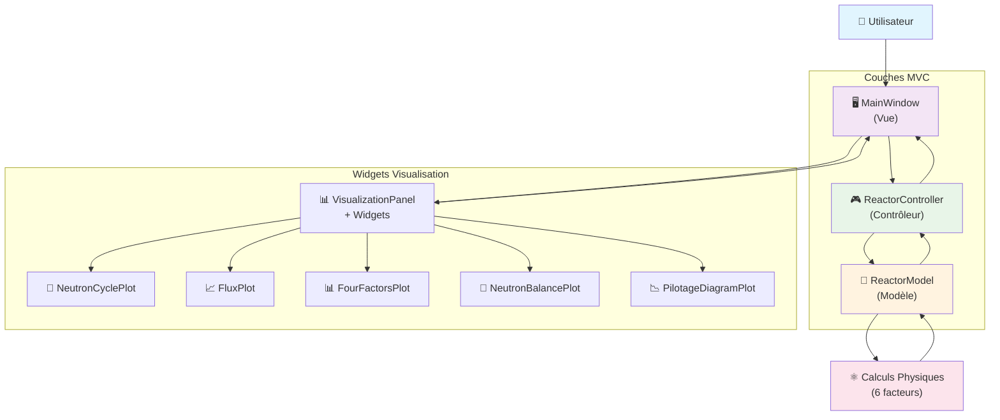
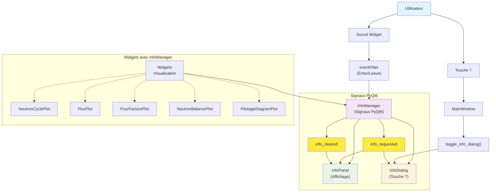

# Architecture de NeutroScope

Ce document décrit l'architecture logicielle de l'application NeutroScope, en se concentrant sur la séparation des responsabilités et le flux de données.

## Vue d'ensemble : Modèle-Vue-Contrôleur (MVC)

Le projet est structuré selon une variante du design pattern **Modèle-Vue-Contrôleur (MVC)** pour garantir une séparation claire entre la logique métier (la physique du réacteur), l'interface utilisateur et la gestion des entrées.

-   **Modèle (`src/model/`)**: Contient la logique de simulation pure. Il ne connaît rien de l'interface utilisateur.
-   **Vue (`src/gui/`)**: Responsable de l'affichage de l'information et de la capture des interactions de l'utilisateur.
-   **Contrôleur (`src/controller/`)**: Sert de pont entre le Modèle et la Vue.

## Structure du Projet et Relations des Composants

```
NeutroScope/
├── src/
│   ├── model/                      # MODÈLE (Logique métier)
│   │   ├── reactor_model.py        # Simulation physique du réacteur
│   │   ├── config.py               # Configuration et paramètres
│   │   └── calculators/            # Modules de calcul spécialisés
│   │
│   ├── controller/                 # CONTRÔLEUR (Orchestration)
│   │   └── reactor_controller.py   # Interface Modèle ↔ Vue
│   │
│   └── gui/                        # VUE (Interface utilisateur)
│       ├── main_window.py          # Fenêtre principale + InfoManager
│       ├── visualization.py        # Gestionnaire des onglets de visualisation
│       │
│       └── widgets/                # Composants d'interface
│           ├── info_manager.py     # Système centralisé d'informations
│           ├── info_panel.py       # Panneau d'infos contextuelles
│           ├── info_dialog.py      # Fenêtre d'infos détaillées
│           ├── enhanced_widgets.py # Widgets avec support InfoManager
│           │
│           ├── neutron_cycle_plot.py    # Widget central (QPainter)
│           ├── flux_plot.py             # Distribution axiale (Matplotlib)
│           ├── four_factors_plot.py     # Facteurs neutroniques (Matplotlib)
│           ├── neutron_balance_plot.py  # Bilan neutronique (Matplotlib)
│           ├── pilotage_diagram_plot.py # Diagramme de pilotage (Matplotlib)
│           │
│           ├── info_button.py      # Bouton 'i' d'information
│           └── credits_button.py   # Bouton de crédits
│
├── tests/                          # Tests unitaires et d'intégration
├── docs/                           # Documentation
│   ├── adr/                        # Architecture Decision Records
│   └── BUILD_WINDOWS.md            # Guide de build Windows complet
├── config.json                     # Configuration externe
├── requirements.txt                # Dépendances Python
├── build_windows.py                # Script de build PyInstaller avancé
├── build_windows.bat               # Script batch automatisé Windows
└── INSTRUCTIONS_BUILD.txt          # Instructions rapides de build
```

### Flux de Données Principal (MVC)



### Système InfoManager



---

## 1. Le Modèle (`src/model/`)

Le cœur de la simulation.

-   **`reactor_model.py`**:
    -   Classe principale : `ReactorModel`.
    -   Implémente les calculs physiques basés sur la **formule des six facteurs** et la théorie de la diffusion à deux groupes pour les fuites.
    -   Contient l'état interne du réacteur : position des barres, concentration en bore, températures, etc.
    -   Expose des méthodes pour mettre à jour ces paramètres et recalculer l'état du réacteur (`k_eff`, réactivité, etc.).
    -   Gère la logique des presets (chargement, sauvegarde).

-   **`config.py`**:
    -   Charge les paramètres de configuration depuis `config.json` (constantes physiques, coefficients du modèle, presets par défaut).
    -   Ne contient aucune logique de simulation, seulement des données.

## 2. Le Contrôleur (`src/controller/`)

L'orchestrateur de l'application.

-   **`reactor_controller.py`**:
    -   Classe principale : `ReactorController`.
    -   Instancie le `ReactorModel`.
    -   Expose des méthodes que la Vue peut appeler en réponse aux actions de l'utilisateur (ex: `update_control_rod_position`).
    -   Traduit les actions de la Vue en appels au Modèle.
    -   Formate les données du Modèle pour qu'elles soient facilement consommables par la Vue.

## 3. La Vue (`src/gui/`)

L'interface utilisateur et l'expérience utilisateur.

-   **`main_window.py`**:
    -   Classe principale : `MainWindow`.
    -   Construit la fenêtre principale et assemble tous les widgets.
    -   Instancie le `ReactorController` et l'**`InfoManager`**.
    -   Connecte les signaux des widgets (ex: `slider.valueChanged`) aux slots (méthodes) correspondants qui appellent le contrôleur.
    -   Gère le raccourci global de la touche 'i' pour afficher/masquer les informations détaillées.

### Système InfoManager (Nouveau)

Un système centralisé de gestion des informations de survol et d'aide contextuelle :

-   **`widgets/info_manager.py`**:
    -   Classe `InfoManager` : Gestionnaire centralisé des informations
    -   Utilise des signaux PyQt6 (`info_requested`, `info_cleared`) pour la communication
    -   Gère l'enregistrement/désenregistrement automatique des widgets
    -   Détecte les événements de survol via `eventFilter`
    -   Classe `InfoMixin` : Mixin pour faciliter l'intégration avec les widgets existants

-   **`widgets/enhanced_widgets.py`**:
    -   Widgets améliorés avec support InfoManager intégré
    -   `InfoGroupBox`, `InfoWidget`, `InfoSlider`, `InfoComboBox`, `InfoLabel`
    -   Encapsulent la logique d'enregistrement et de nettoyage automatique

-   **`widgets/info_panel.py`**:
    -   Panneau d'affichage des informations contextuelles
    -   Mise à jour en temps réel sans délai de débouncing
    -   Support du formatage HTML pour un rendu riche

-   **`widgets/info_dialog.py`**:
    -   Fenêtre modale pour afficher des informations détaillées
    -   Activée par la touche 'i' ou le bouton d'information
    -   Fenêtre non-modale permettant l'interaction continue

### Widgets de Visualisation

-   **`widgets/`**:
    -   Contient des composants d'interface réutilisables (graphiques, panneaux d'information, boutons personnalisés).
    -   **`neutron_cycle_plot.py`** : Widget central utilisant QPainter pour dessiner le diagramme du cycle neutronique avec textes agrandis et informations enrichies en français.
    -   **Widgets matplotlib** : `flux_plot.py`, `four_factors_plot.py`, `neutron_balance_plot.py`, `pilotage_diagram_plot.py`
    -   Tous les widgets acceptent et utilisent l'`InfoManager` pour les informations contextuelles
    -   Gestion des événements de souris (`mpl_connect` pour matplotlib, `mouseMoveEvent` pour QPainter)

-   **`visualization.py`**:
    -   Classe `VisualizationPanel` : Gère la mise en page des différents graphiques dans un `QTabWidget`
    -   **Injection de dépendances** : Reçoit l'`InfoManager` et le transmet à tous les widgets de visualisation
    -   Le premier onglet est le `NeutronCyclePlot` amélioré

## Flux de Données et Architecture InfoManager

### Flux Principal (Exemple : Mouvement d'un slider)

1.  **Utilisateur** : Déplace le slider de la position des barres de contrôle.
2.  **Vue (`MainWindow`)**: Le signal `valueChanged` du `QSlider` est émis.
3.  **Vue (`MainWindow`)**: Le slot connecté (`on_rod_position_changed`) est appelé.
4.  **Vue (`MainWindow`)**: Appelle `self.controller.update_control_rod_position(new_value)`.
5.  **Contrôleur (`ReactorController`)**: Appelle `self.model.update_control_rod_position(new_value)`.
6.  **Modèle (`ReactorModel`)**: Met à jour son état interne (`self.control_rod_position`).
7.  **Modèle (`ReactorModel`)**: Lance un recalcul complet (`calculate_all()`).
8.  **Contrôleur (`ReactorController`)**: Récupère les nouvelles données du modèle (`get_reactor_parameters`, `get_neutron_cycle_data`, etc.).
9.  **Vue (`MainWindow`)**: Appelle les méthodes de mise à jour de `VisualizationPanel`, qui à son tour met à jour tous les graphiques, y compris le `NeutronCyclePlot`.

### Flux InfoManager (Exemple : Survol d'un élément)

1.  **Utilisateur** : Survole un widget enregistré avec l'InfoManager.
2.  **InfoManager** : Détecte l'événement via `eventFilter` (événement `Enter`).
3.  **InfoManager** : Émet le signal `info_requested` avec le texte d'information associé.
4.  **InfoPanel** : Reçoit le signal et met à jour instantanément son contenu.
5.  **Utilisateur** : Quitte le widget.
6.  **InfoManager** : Détecte l'événement `Leave` et émet `info_cleared`.
7.  **InfoPanel** : Reçoit le signal et affiche le contenu par défaut.

### Gestion de la Touche 'i'

1.  **Utilisateur** : Appuie sur la touche 'i'.
2.  **MainWindow** : Le `QShortcut` capture l'événement et appelle `toggle_info_dialog()`.
3.  **MainWindow** : Vérifie s'il y a du contenu d'information disponible via l'InfoPanel.
4.  **MainWindow** : Si du contenu existe, ouvre/ferme la `InfoDialog` avec le contenu détaillé.
5.  **InfoDialog** : Affiche le contenu dans une fenêtre non-modale permettant l'interaction continue.

## Patterns Architecturaux Clés

### 1. Injection de Dépendances
L'`InfoManager` est créé dans `MainWindow` et injecté dans tous les widgets qui en ont besoin :
```python
self.info_manager = InfoManager(self)
self.visualization_panel = VisualizationPanel(self, info_manager=self.info_manager)
```

### 2. Observer Pattern
Utilisation des signaux PyQt6 pour le découplage :
- `InfoManager` émet `info_requested`/`info_cleared`
- `InfoPanel` écoute et reagit aux signaux
- Aucune dépendance directe entre les composants

### 3. Composition over Inheritance  
Les widgets utilisent l'InfoManager par composition plutôt que par héritage, permettant une flexibilité maximale.

### 4. Single Responsibility
Chaque composant a une responsabilité claire :
- `InfoManager` : Gestion centralisée des informations
- `InfoPanel` : Affichage des informations contextuelles
- `InfoDialog` : Affichage des informations détaillées
- Widgets de visualisation : Rendu et interaction utilisateur

Cette architecture garantit que la logique de simulation peut être testée indépendamment de l'interface, et que l'interface peut être modifiée sans impacter la physique du modèle. Le système InfoManager ajoute une couche robuste de support utilisateur avec des informations contextuelles riches et une expérience utilisateur fluide. 