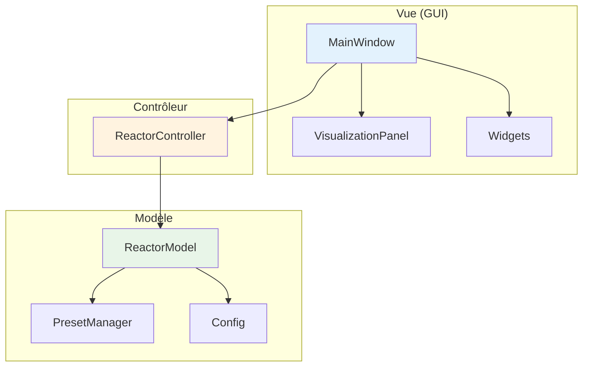
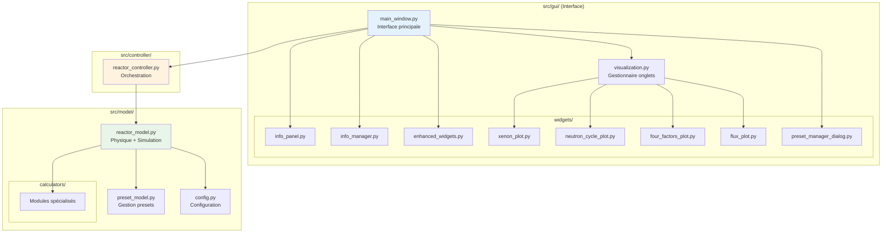
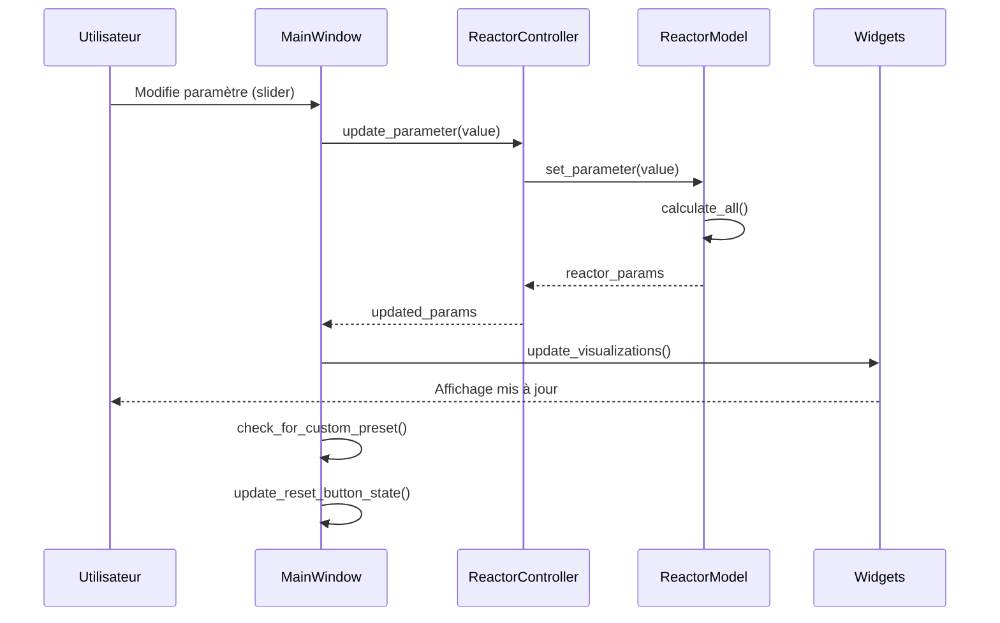
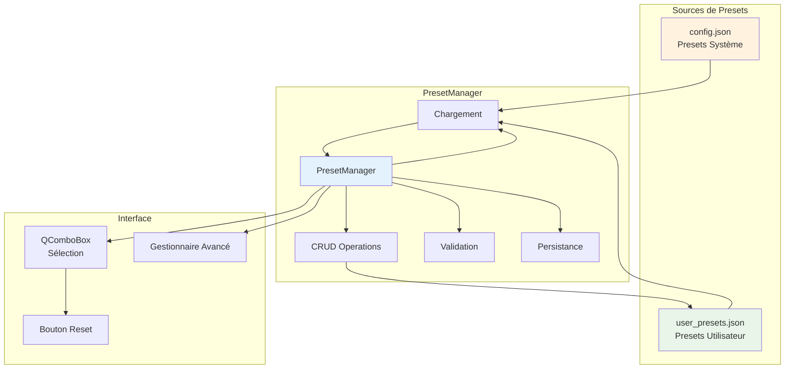
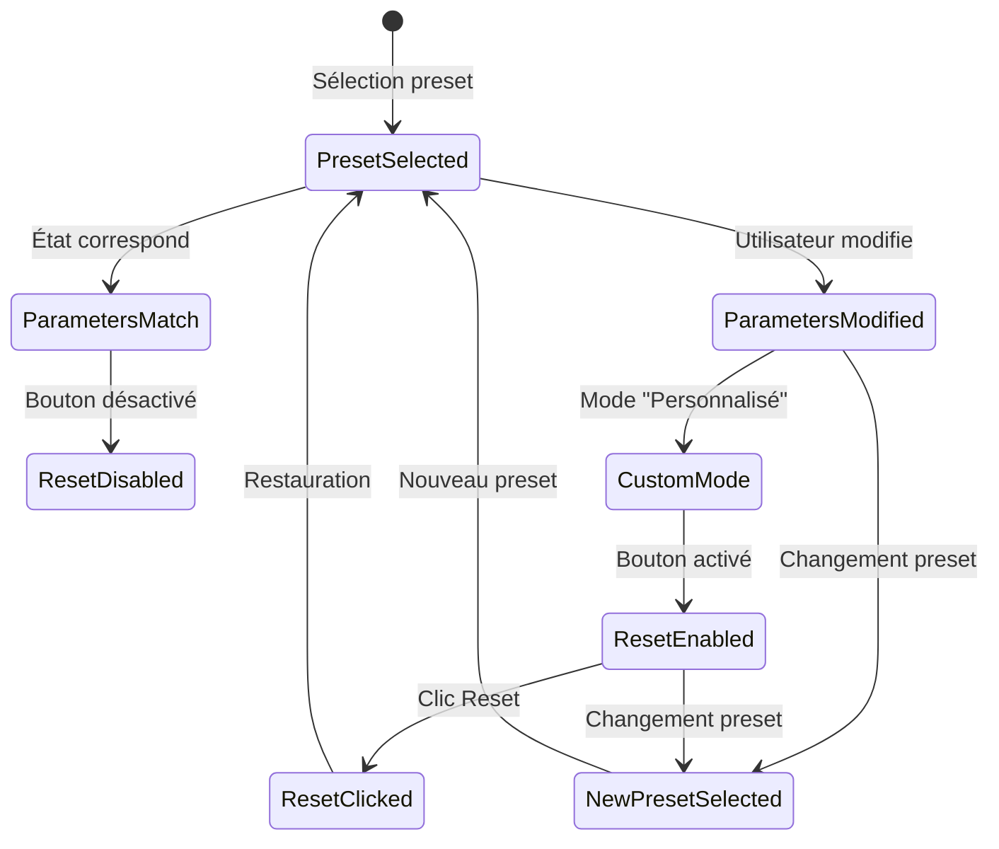
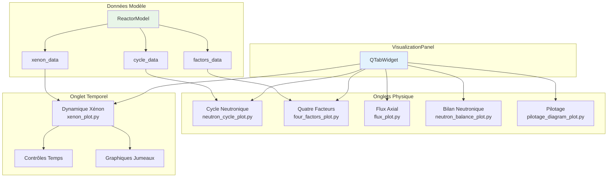
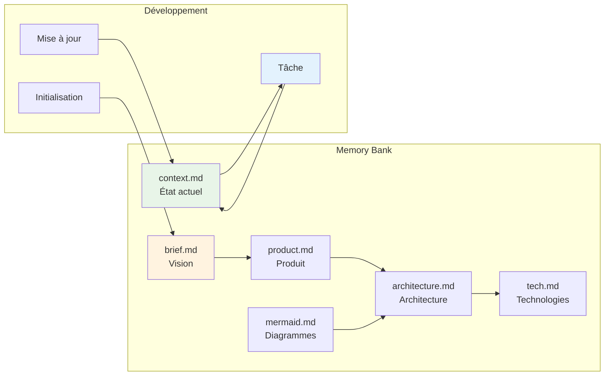
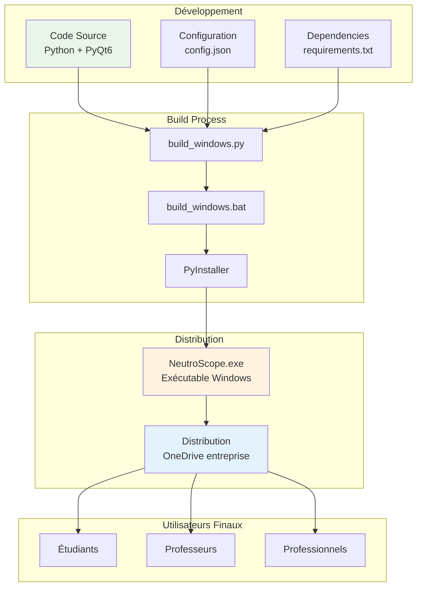

# Diagrammes Architecturaux NeutroScope

Ce fichier contient les diagrammes Mermaid essentiels pour comprendre l'architecture et le fonctionnement de NeutroScope.

## 1. Architecture MVC Globale



## 2. Structure Détaillée des Composants



## 3. Flux de Données Utilisateur



## 4. Système de Presets Avancé



## 5. Cycle de Simulation Temporelle (Xénon-135)

```mermaid
graph TB
    subgraph "État Initial"
        EQUI[Équilibre Xénon<br/>calculate_xenon_equilibrium()]
    end
    
    subgraph "Simulation Temporelle"
        ADV[advance_time(hours)]
        BAT[Équations Bateman<br/>I-135 → Xe-135]
        UPD[update_xenon_dynamics(dt)]
        CALC[calculate_all()]
    end
    
    subgraph "Visualisation"
        XW[XenonVisualizationWidget]
        GRAPH[Graphiques concentrations]
        HIST[Historique temporel]
    end
    
    subgraph "Contrôles"
        RESET_XE[Reset Équilibre]
        TIME_CTL[Contrôles Temps]
    end
    
    EQUI --> ADV
    ADV --> BAT
    BAT --> UPD
    UPD --> CALC
    CALC --> XW
    XW --> GRAPH
    XW --> HIST
    
    TIME_CTL --> ADV
    RESET_XE --> EQUI
    
    style EQUI fill:#fff3e0
    style BAT fill:#e8f5e8
    style XW fill:#e3f2fd
```

## 6. Système d'Information Contextuel

```mermaid
graph TD
    subgraph "Gestion Info"
        IM[InfoManager<br/>Centralisé]
        IM --> REG[register_widget()]
        IM --> TRACK[Mouse Tracking]
        IM --> EMIT[Signaux info]
    end
    
    subgraph "Affichage"
        IP[InfoPanel<br/>Toujours visible]
        ID[InfoDialog<br/>Touche 'i']
        TT[Tooltips<br/>Survol souris]
    end
    
    subgraph "Widgets Enhanced"
        IGB[InfoGroupBox]
        IW[InfoWidget]
        IS[InfoSlider]
        IC[InfoComboBox]
    end
    
    EMIT --> IP
    EMIT --> ID
    
    IGB --> REG
    IW --> REG
    IS --> REG
    IC --> REG
    
    TRACK --> TT
    
    style IM fill:#e3f2fd
    style IP fill:#fff3e0
    style ID fill:#e8f5e8
```

## 7. Gestion des États et Bouton Reset



## 8. Architecture des Visualisations



## 9. Workflow Développement et Mémoire



## 10. Pipeline de Build et Distribution

