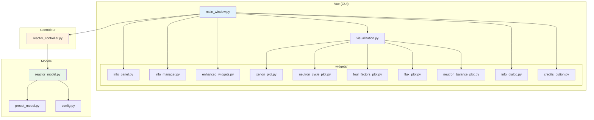
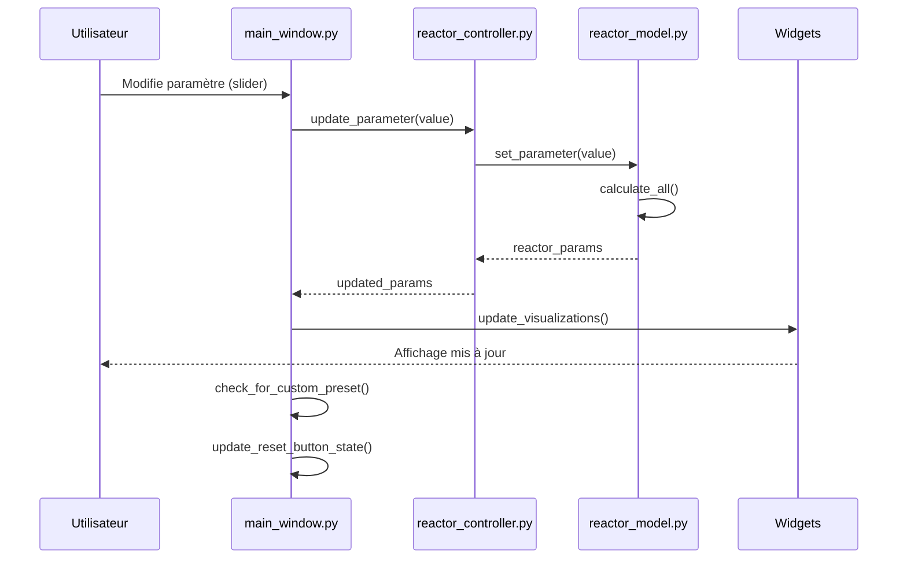
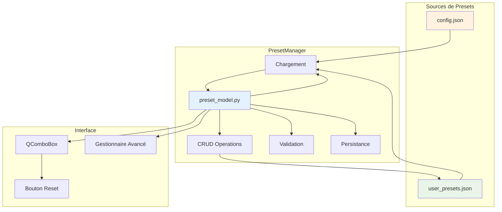
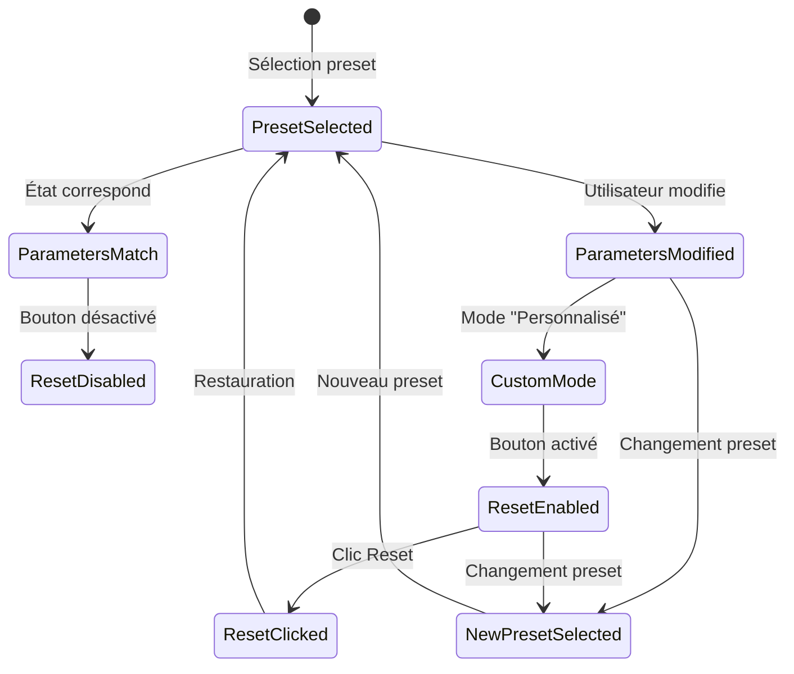
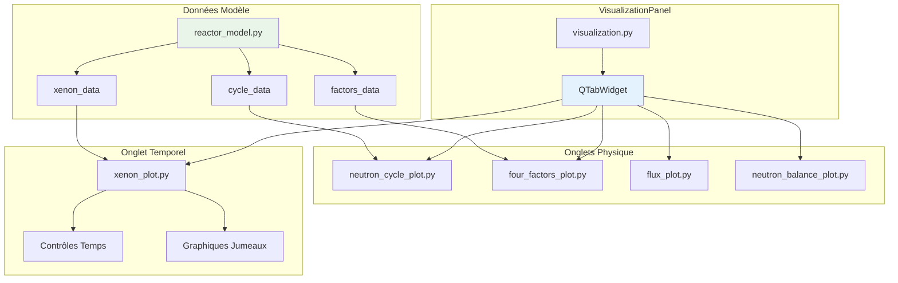
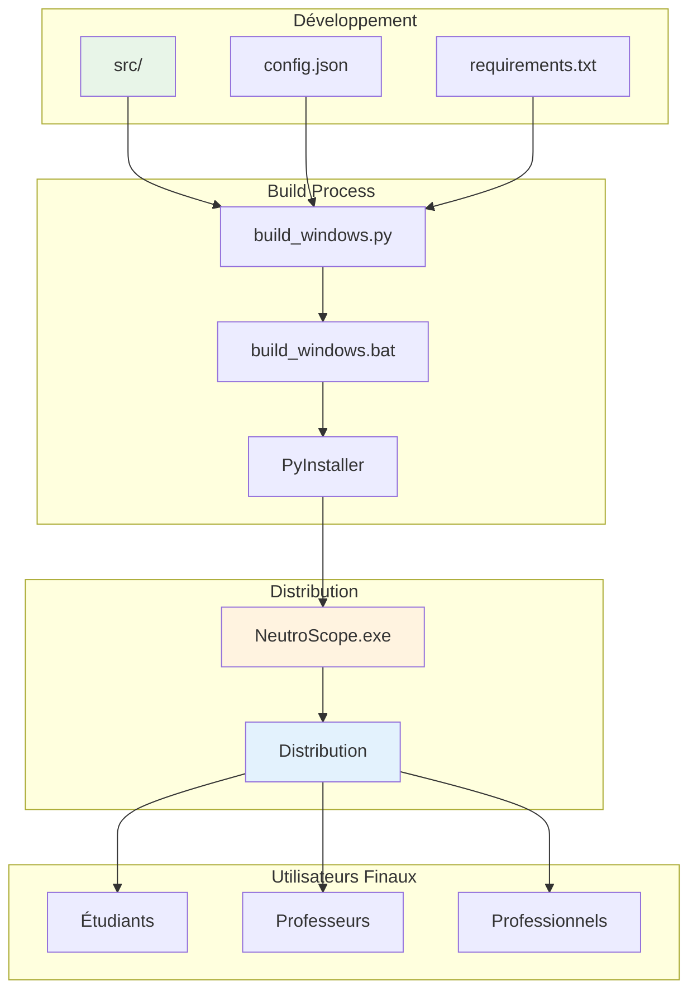
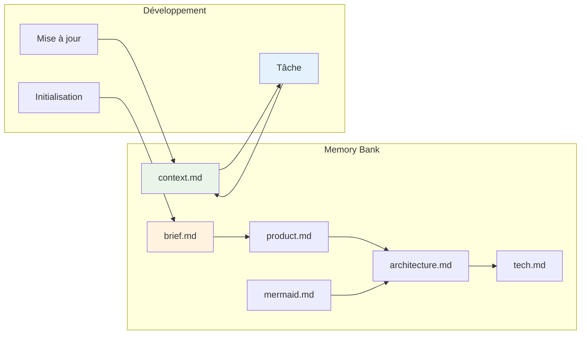

# Diagrammes Architecturaux NeutroScope

Ce fichier contient les diagrammes Mermaid essentiels pour comprendre l'architecture et le fonctionnement de NeutroScope.

## 1. Architecture MVC Globale



## 2. Flux de Données Utilisateur



## 3. Système de Presets



## 4. Cycle de Simulation Temporelle (Xénon-135)

```mermaid
graph TB
    subgraph "État Initial"
        EQUI[Équilibre Xénon\ncalculate_xenon_equilibrium()]
    end
    subgraph "Simulation Temporelle"
        ADV[advance_time(hours)]
        BAT[Équations Bateman\nI-135 → Xe-135]
        UPD[update_xenon_dynamics(dt)]
        CALC[calculate_all()]
    end
    subgraph "Visualisation"
        XP[xenon_plot.py]
        GRAPH[Graphiques concentrations]
        HIST[Historique temporel]
    end
    subgraph "Contrôles"
        RESET_XE[Reset Équilibre]
        TIME_CTL[Contrôles Temps]
    end
    EQUI --> ADV
    ADV --> BAT
    BAT --> UPD
    UPD --> CALC
    CALC --> XP
    XP --> GRAPH
    XP --> HIST
    TIME_CTL --> ADV
    RESET_XE --> EQUI
    style EQUI fill:#fff3e0
    style BAT fill:#e8f5e8
    style XP fill:#e3f2fd
```

## 5. Système d'Information Contextuel

```mermaid
graph TD
    subgraph "Gestion Info"
        IM[info_manager.py]
        IM --> REG[register_widget()]
        IM --> TRACK[Mouse Tracking]
        IM --> EMIT[Signaux info]
    end
    subgraph "Affichage"
        IP[info_panel.py]
        ID[info_dialog.py]
        TT[Tooltips]
    end
    subgraph "Widgets Enhanced"
        EW[enhanced_widgets.py]
        IGB[InfoGroupBox]
        IW[InfoWidget]
        IS[InfoSlider]
        IC[InfoComboBox]
    end
    EMIT --> IP
    EMIT --> ID
    IGB --> REG
    IW --> REG
    IS --> REG
    IC --> REG
    TRACK --> TT
    style IM fill:#e3f2fd
    style IP fill:#fff3e0
    style ID fill:#e8f5e8
```

## 6. Gestion des États et Bouton Reset



## 7. Architecture des Visualisations



## 8. Pipeline de Build et Distribution



## 9. Workflow Développement et Mémoire

